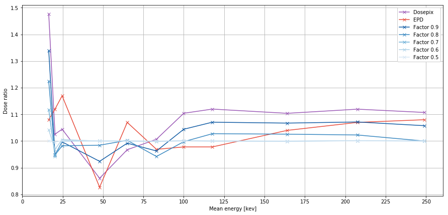
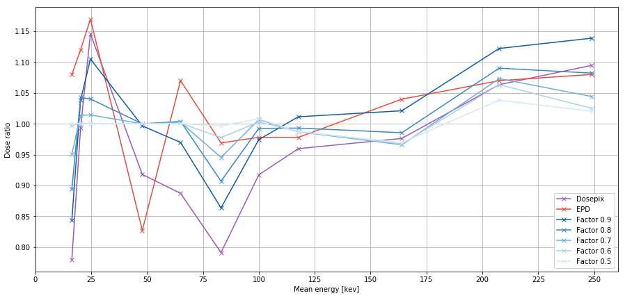
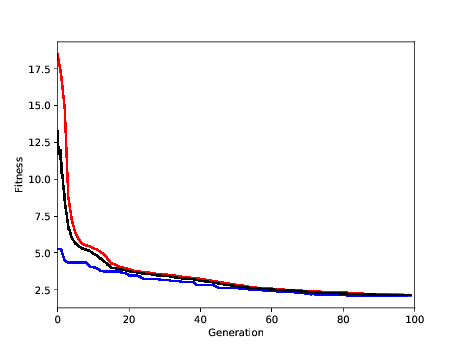

# Optimization of conversion factors

## Calculation of the dose

Given a matrix $\hat N$, containing taken energy spectra for a source emitting a certain dose as their rows. Each row consists of 16 bins where the histogram itself was made by previously specified bin edges (see [section 'Optimization of bin edges'](#optimization-of-bin-edges)).  
The doses $\vec D$ for all spectra are calculated from the measured data $\hat N$ using a set of conversion factors $\vec \alpha$ via 
$$
\vec D = \hat N \cdot \vec \alpha.
$$

## EPD vs. Dosepix (Thilo)

$\vec \alpha$ was fitted using simulations made by Thilo (see [file](data/conversion.csv) and table below for conversion factors). Notice that Slot 1 is free field, Slot 2 is aluminium (Al) and Slot 3 is tin (Sn).
| Slot 1   | Slot 2   | Slot 3    |
| :------- | :------- | :-------- |
| 0.002171 | 0.007387 | 0.000285  |
| 0.002262 | 0.005770 | -0.001509 |
| 0.002392 | 0.002779 | -0.001899 |
| 0.001639 | 0.003638 | -0.000502 |
| 0.000773 | 0.002092 | -0.000011 |
| 0.001357 | 0.001789 | 0.001386  |
| 0.000683 | 0.001132 | 0.002413  |
| 0.000445 | 0.000682 | 0.001704  |
| 0.000182 | 0.000377 | 0.001879  |
| 0.000101 | 0.000358 | 0.001899  |
| 0.000034 | 0.000223 | 0.001869  |
| 0.000027 | 0.000182 | 0.001653  |
| 0.000024 | 0.000145 | 0.001263  |
| 0.000024 | 0.000137 | 0.000992  |
| 0.000029 | 0.000113 | 0.000967  |
| 0.000018 | 0.000341 | 0.000757  |
Keep in mind that the fit itself also took negative factors into consideration (unphysical, since in extreme cases the resulting dose might be negative).  
Measurements with the EPD were taken and its dose is set as reference. The dose ratio $R_i = \frac{D_{\mathrm{DPX}, i}}{D_{\mathrm{EPD},i}}$ was optimized where $R_i = 1$ is the best value to be achieved. Here, $\vec \alpha$ is used as start parameter $\vec p$ for the fit. At the same time, the parameter boundaries are set to $\vec p_{\mathrm{low}, i},\, \vec p_{\mathrm{high}, i} = (f\cdot\alpha_i,\, (1+(1-f))\cdot \alpha_i)$, where $f$ is a factor between 0.5 and 1. This is set to only slightly vary the values of $\vec \alpha$ instead of performing a free fit as the initial $\vec \alpha$ was determined by simulations. If $\alpha_i$ is negative, the boundaries are set to $\vec p_{\mathrm{low}, i},\, \vec p_{\mathrm{high}, i} = (0,\, \infty)$. This in the end results in the execution of a NNLS (**N**on **N**egative **L**east **S**quares) fit.

### Fit w/o error
The fit optimizes 
$$
\Vert \hat N\cdot\alpha - \vec D_\mathrm{EPD} \Vert.
$$
The error of $\hat N$ is not considered during the fit. The resulting curves for differnt values of $f$ are shown in the figure below. Here, the dose ratio $R_i$ is shown as a function of the mean energy $E_i$. The resulting conversion factors for $f = 0.9$ can be found [here](data/conversionFit_woerror.csv).
|  |
| :--------------------------------------- |
| Fit of conversion factors to measured data using different factors of $f$. |

### Fit w error
The fit considers the error of $\hat N$ and optimizes 
$$
\left\Vert\frac{1}{\Delta \alpha_{j}}{(N_{ij}\cdot\alpha_j - \vec D_{\mathrm{EPD},j)}}\right\Vert
$$
with 
$$
\begin{align*}
	\Delta \alpha_i &= \sqrt{\Delta N_{ij}^2\cdot\alpha_j^2},\\
	\Delta N_{ij} &= \sqrt{N_{ij}}.
\end{align*}
$$
|  |
| :--------------------------------------- |
| Fit of conversion factors to measured data using different factors of $f$ under the consideration of errors of $\hat N$. |

### Fit with new $\vec \alpha$
A new fit was performed using the energy spectra from Thilo's simulation while leaving the values of the bin edges as they were. Now, a NNLS is used so $\alpha_i \geq 0$ is guaranteed.  
The resulting $\vec \alpha$ (see [file](conversionFitSim.csv)) can be further optimized by performing fits under the consideration of errors.
|  |
| :--------------------------------------- |
| Fit of conversion factors to measured data using the $\vec \alpha$ estimated by a NNLS fit. |

# Optimization of bin edges

## Definition of $\chi^2$

Here, $\chi^2$ is specified as follows:
$$
\chi^2 = \sum_i (\hat N\cdot \alpha - \vec D)^2
$$
In this case, $\vec D$ is a theoretical input value of the simulation which generates $\hat N$ accordingly.

## Optimization method

Both described methods use the energy spectra generated by the simulation as their input values.  These consist of 4501 equally spaced bins each. Since the real detector is only able to store 16 bins, the primary spectra have to rebinned. It is important to choose these bin edges so that the deviation of the reconstructed dose $\vec D_\mathrm{R}$ and the input dose $\vec D$ of the simulation is minimal. The fraction of both values is called response and is defined as
$$
R_i = \frac{D_{\mathrm R, i}}{D_i},
$$
for each energy $E_i$. 

### Old method

For each energy $E_i$ the response is normalized in the following way:
$$
\hat R_i =
\begin{cases}
 -\frac{R_i - 1}{0.29} &\text{ if } R_i - 1 < 0 \\ 
 \frac{R_i - 1}{0.67} &\text{ else } 
\end{cases}.
$$
In the end, the sum over the normalized responses
$$
\sum_i \hat R_i
$$
is minimized.

### New method

The $\chi^2$ value is minimized, i.e.:
$$
\left\vert \sum_i (D_{\text R, i} - D_i)^2 \right\vert.
$$

## Optimization results

- Using data of folder '*runs_combined*'

- Fluence is set to 
$$
\phi = 5 \cdot 400000 \cdot 1000.0 \cdot \frac{1}{(30\, \mathrm{cm})^2}
$$
- Current value of chi-squared (neglecting $\sigma_i$):
$$
\chi^2 = 6.202
$$

Optimization via genetic algorithm with a starting population of 30, running for 100 generations.  

> Result:
> $$
> \chi^2 = 2.075
> $$
>

Progress of optimization:

Bin edges ([file](data/binEdges.csv)):  

| Slot 1 | Slot 2 | Slot 3 |
| :----- | :----- | :----- |
| 12.1   | 12.1   | 9.3    |
| 23.7   | 36.2   | 33.4   |
| 55.2   | 53.1   | 67.6   |
| 59.9   | 82.6   | 114.1  |
| 78.6   | 109.9  | 118.7  |
| 96.2   | 144.1  | 141.8  |
| 97.5   | 172.4  | 153.6  |
| 121.7  | 211.1  | 161.3  |
| 149.8  | 222.4  | 216.7  |
| 160.1  | 238.7  | 258.2  |
| 210.0  | 265.6  | 262.2  |
| 256.8  | 282.7  | 266.4  |
| 313.9  | 317.6  | 294.5  |
| 366.6  | 343.9  | 344.9  |
| 374.1  | 388.0  | 366.6  |
| 416.9  | 409.3  | 400.1  |
| 425.3  | 424.4  | 414.0  |

Final fitness: 2.085